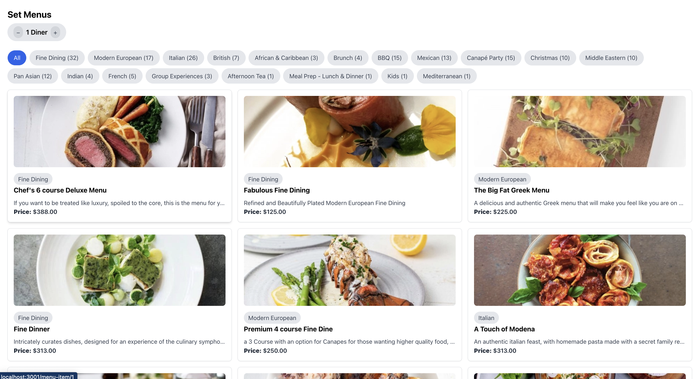

# Menu items frontend

A basic front end built in react, mainly playing around.

> 


## Installation

1. Install backend

Before beginning this installation, please ensure you have the backend installed from the repo at https://github.com/clintondeacon/menuitems_backend

2. Clone respository


3. Install dependencies

```bash
yarn
/*OR*/
npm install
```
4. Start the application

```bash
yarn start
```

You can rerun this script at any time to completely refresh the data.

5. Potential Cors issue

You may potentially run into cors issues if the local URL is not http://localhost:3000. If so, you will need to add whatever local URL to the config/cors.php file on the backend

